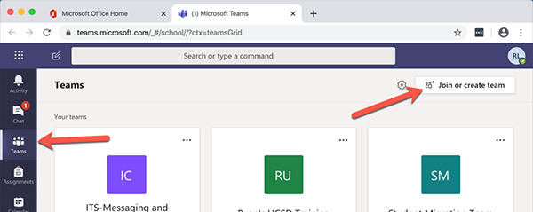
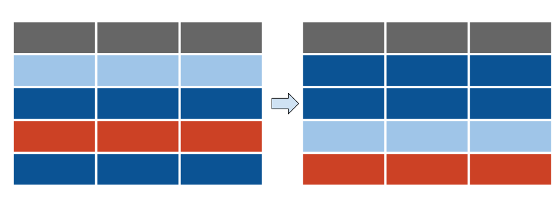

```{r setup, include=FALSE}
options(htmltools.dir.version = FALSE)
library(tidyverse)
library(lubridate)
library(hrbrthemes)
library(xaringanthemer)
library(xaringanExtra)
xaringanExtra::use_tachyons()
library(countdown)
library(googlesheets4)
```
```{r themes, warning=FALSE, include=FALSE}
style_duo_accent(primary_color = "#012169", secondary_color = "#005587")
# form_data <- read_csv("data/_20200901 Pre-Workshop Survey.csv", 
#     col_types = cols(Timestamp = col_datetime(format = "%m/%d/%Y %H:%M")), 
#     skip = 1)

# *** RUN gs4_auth() in the console ***
# gs4_auth_configure()
pre_workshop <- read_sheet(params$goog_sheet)
post_workshop <-
  read_sheet("https://docs.google.com/spreadsheets/d/18-xeU5YAOr0iu7Pk22Zrb0BziLuoVe8nyCyd1-O2R7U/edit#gid=123486400")

# mynames_pre <- read_csv("data/colnames_preworkshop_20200918.csv")
# # mynames_post <- read_csv("data/colnames_postworkshop.csv")
mynames_pre  <- read_csv("data/colnames_part1_preworkshop_2021fall.csv")
mynames_post <- read_csv("data/colnames_part1_postworkshop_2021fall.csv")

colnames(pre_workshop) <- mynames_pre$value
colnames(post_workshop) <- mynames_post$value

pre_workshop <- pre_workshop %>%
  mutate(survey_type = "pre")
post_workshop <- post_workshop %>%
  mutate(survey_type = "post") 
# post_workshop <- post_workshop %>% 
#   filter(!str_detect(search4answers, "NOTE")) %>% 
#   mutate(survey_type = "post") %>% 
#   select(-what_worked, -continue_curriculum, -add_curriculum)
```
class: middle
.tc.bg-light-silver.b--navy.f.ba.bw1.br4.shadow-5.ph4.mt1[

### R for computational sciences

.f3.near-white[  
quickStart: Projects, data wrangling, EDA, viz
]  

**Flipped Workshop**  
.f6[
Jan 20, 10am to Noon
]
]  

1. Did you already **complete** the pre-workshop **survey**?  (check your email)
2. **You watched the videos** .black-30[(part 1a and 1b)] and have questions  
3. We will start exercises and answer questions as the countdown reaches zero...


.f6.black-40[
https://<a href = "https://johnlittle.info">JohnLittle</a>.info  
https://<a href = "https://Rfun.library.duke.edu">Rfun.library.duke</a>.edu  
Data Science Librarian  
Center for Data & Visualization Sciences  
Duke University Libraries  
library.duke.edu/<a href="https://library.duke.edu/data">data</a>]  

```{r echo=FALSE}
countdown::countdown(minutes = 20, seconds = 15)
```

---
## Duke University: Land Acknowledgement

I would like to take a moment to honor the land in Durham, NC.  Duke University sits on the ancestral lands of the Shakori, Eno and Catawba people. This institution of higher education is built on land stolen from those peoples.  These tribes were here before the colonizers arrived.  Additionally this land has borne witness to over 400 years of the enslavement, torture, and systematic mistreatment of African people and their descendants.  Recognizing this history is an honest attempt to breakout beyond persistent patterns of colonization and to rewrite the erasure of Indigenous and Black peoples.  There is value in acknowledging the history of our occupied spaces and places.  I hope we can glimpse an understanding of these histories by recognizing the origins of collective journeys.

---
background-image: url(images/who_we_are2_20210924.svg)
background-size: contain
<!-- generated from analysis_workshop_attendance/libcal_roster.Rmd -->
<!-- https://github.com/libjohn/workshop_attendance/blob/master/libcal_roster.Rmd -->

---
background-image: url(images/who_we_are_facet_20210924.svg)
background-size: contain
<!-- generated from analysis_workshop_attendance/libcal_roster.Rmd -->
<!-- https://github.com/libjohn/workshop_attendance/blob/master/libcal_roster.Rmd -->

---
```{r response rate plot, echo=FALSE, fig.height=9, fig.width=16, message=FALSE, warning=FALSE, dev="svg"}
response_rate <- nrow(pre_workshop) / params$registered

pre_workshop %>% 
  mutate(day = lubridate::yday(timestamp)) %>%
  count(day) %>% 
  ggplot(aes(day, n)) +
  geom_line() +
  geom_point() +
  scale_x_continuous(minor_breaks = NULL, 
                     breaks = params$days_of_year_number_range,
                     labels = params$days_label) +
  # scale_y_continuous(minor_breaks = NULL, breaks = scales::pretty_breaks()) +
  scale_y_continuous(breaks = c(1:4)) +
  # expand_limits(y = c(0,5)) +
  labs(title = "Response rate over time",
       subtitle = glue::glue("n = {nrow(pre_workshop)} ; {scales::percent(response_rate)} response rate"),
       y = "", x = "",
       caption = "Source:  CDVS Pre-workshop survey") 


```

---
```{r experience plot, echo=FALSE, fig.height=9, fig.width=16, message=FALSE, warning=FALSE, dev="svg"}
pre_workshop %>% 
  pivot_longer(starts_with("tools_"), names_to = "question", values_to = "answer") %>% 
  mutate(question = str_extract(question, "(?<=tools_)\\w+")) %>% 
  mutate(question = factor(question, levels = c("coder", "models", 
                                                "version_ctrl", "cli", "rdbms"),
                           labels = c("Coder", "Models", "Version control", "CLI", "RDBMS"))) %>% 
  mutate(answer = factor(answer, levels = c("Daily", "Weekly", "Monthly",
                                            "Several Times per year",
                                            "Less than once per year",
                                            "Never"))) %>% 
  ggplot(aes(fct_rev(question))) +
  geom_bar(aes(fill = answer), position = "fill") +
  coord_flip() +
  scale_fill_brewer(palette = "Dark2") +
  scale_y_continuous(labels = scales::percent) +
  labs(title = "Self-reported tool usage",
       subtitle = "Respondent's use of a tool / technology / technique",
       x = "", y = "Percent",
       caption = "Source:  CDVS Pre-workshop survey") +
  theme_ipsum(grid = "X") +
  theme(plot.title.position = "plot") 
```

---

```{r, skills level plot, echo=FALSE, fig.height=9, fig.width=16, message=FALSE, warning=FALSE, dev="svg"}
pre_workshop %>% 
  pivot_longer(ends_with("_experience"), 
               names_to = "question", 
               values_to = "answer") %>% 
  mutate(answer = factor(answer, 
                         levels = c("Strongly agree", "Agree", 
                                    "Neutral", "Disagree", 
                                    "Strongly disagree"))) %>%
  mutate(question  = factor(question,
                            levels = c("import_experience", "scripts_experience", "subset_experience",
                                       "projects_experience", "reproducible_experience", "apply_learning"),
                            labels = c("Import data", "Edit scripts",
                                       "Subset data", "Projects",
                                       "Reproducibility", "Apply learning"))) %>%
  ggplot(aes(fct_rev(question))) +
  geom_bar(aes(fill = answer), position = "fill") +
  coord_flip() +
  scale_fill_brewer(palette = "Spectral") +
  scale_y_continuous(labels = scales::percent) +
  labs(title = "Self-reported R skills",
       subtitle = "Respondents feel capable of completing a Tidyverse task",
       x = "", y = "Percent",
       caption = "Source:  CDVS Pre-workshop survey",
       fill = "") +
  theme_ipsum(grid = "X") +
  theme(plot.title.position = "plot")
```

---

```{r data mgt plot, echo=FALSE, fig.height=9, fig.width=16, message=FALSE, warning=FALSE, dev="svg"}

orange_bar <- fct_count(pre_workshop$data_mgt_satisfy, sort = TRUE) %>% 
  slice_head(n = 1) %>% 
  pull(f)


data_mgt_plot <- pre_workshop %>% 
  mutate(data_mgt_satisfy = if_else(data_mgt_satisfy == "Nor sure", "Not Sure", data_mgt_satisfy)) %>% 
  ggplot(aes(fct_relevel(data_mgt_satisfy, "Very unsatisfied", "Unsatisfied", "Neutral", "Satisfied", "Very satisfied"))) +
  geom_bar() +
  geom_bar(data = . %>% filter(data_mgt_satisfy == orange_bar), 
           aes(data_mgt_satisfy), 
           fill = "darkorange", color = "darkorange") + 
  geom_bar(data = . %>% filter(data_mgt_satisfy == "Not sure"), fill = "grey70") +
  scale_y_continuous(breaks = seq(0, 15, 3), minor_breaks = NULL) +
  theme_minimal() +
  labs(title = "Satisfaction with current Data Management workflow",
       subtitle = "self reported",
       x = "", y = "",
       caption = "Source:  CDVS Pre-workshop survey")

data_mgt_plot +
  theme_minimal() +
  theme(plot.title.position = "plot",
        panel.grid.major.x = element_blank())
```

---
background-color:  	#2A2A2A
background-size: contain

```{r dta mgt theme_alt, fig.cap="foo", fig.height=9, fig.width=16, message=FALSE, warning=FALSE, dev="svg", echo=FALSE}
data_mgt_plot +
  theme_ft_rc(grid = "Y") +
  theme(plot.title.position = "plot",
        panel.grid.major.x = element_blank())

# ggsave("images/plot_theme_alt.svg")
```


---
exclude: true
background-image: url(images/plot_theme_alt.svg)
background-size: cover

---
exclude: true
class: center, middle
## Microsoft Teams: Rfun

Rfun on MS Teams is a professional learning community for Duke U.

_Teams like Slack_

Join with code **ko8ovx2**



Or, https://is.gd/rfun_teams


---
### Consulting and Assistance

We're happy to consult with you.   We can make the details relevant to your project

Title | URL
--- | ---
Schedule me for consultations | https://is.gd/littleconsult
Consulting & [AskData@Duke.edu](mailto:AskData@Duke.edu)         | https://library.duke.edu/data/consulting


### Resources

It's all online

Title | URL
--- | ---
rfun_flipped codebase       | https://github.com/libjohn/rfun_flipped
exercises                   | https://github.com/libjohn/intro2r_exercises
Rfun                        | https://rfun.library.duke.edu
Center for data & Viz       | https://library.duke.edu/data

---
class: middle, center

## Reprex

_The most efficient way to get help_

REPRoducible EXample and Code

https://reprex.tidyverse.org

--

.tc.bg-light-silver.b--navy.f.ba.bw1.br4.shadow-5.ph4.mt1[
Use the smallest, simplest, most built-in data possible

Include commands on a strict “need to run” basis
]


---
class: middle, center
# Pipes and Assignment

---
class: middle, center

# Assignment

Give an object name particular value

## `<-`

"gets value from"

`answer <- 5 * 5`

`mutate(answer2 = answer * 2)`

&nbsp;  

Keyboard shortcut for `<-`:  _alt-dash_

---
class: middle, center

# Pipe

Chain functions together (a tidyverse or magrittr conjunction)

## `%>%`  

"and then"

`answer %>% sqrt()`

&nbsp;  

Keyboard shortcut:  _Ctrl/Cmd-Shift-M_


---

# Definitions

R is a **data-first programming language** with mature sense of the _data life-cycle_ and reproducibility

**R** - programming language / compiler / kernel  
**RStudio** - an IDE or Integrated Development Environment  
**Tidyverse** - a coherent and opinionated system of packages for data manipulation, exploration, and visualization.  
**Tidy data** - a foundational concept governing the shape of your data.  https://vita.had.co.nz    

---

# Outline

**Reproducibility**  

**RStudio projects**   

**Literate coding**  

**5 dplyr verbs**

---
class: middle

# Reproducibility

Obtaining computational results using the same input data, computational steps, methods, code, and conditions of analysis


---
class: middle

# RStudio projects

.pull-left[Managing each project in a discrete directory that can be easily shared with others.  That is, your projects can work on other computers without rewriting the code.

- Enables the use of relative paths instead of `setwd()`
- Using R Markdown to **Restart R and run all chunks** instead of `rm(lists = ls())`
- Integrates with **version control** (e.g. _Git_)

]

.pull-right[


]
---
class: middle

# Literate coding

Using a single document, integrate and intersperse prose with code.  Explain your analysis with natural language. Render various outputs from the same document.  

_R Markdown & Jupyter notebooks are an example of literate coding_

---
class: middle

# Why

Using lierate code techniques within RStudio projects helps you easily avoid a big enemy of reproducibility:  workflows which are dependent on cut & paste mousing 

Today, we'll use .Rmd files to render R Markdown notebooks

---

class: middle

# `dplyr` 

A grammar of data manipulation

- consistent verbs to solve common data transforms

- https://dplyr.tidyverse.org/

---
class: middle

## Five `dplyr` Verbs

Function | Usage
:--- | :---
`filter` | subset rows
`select` | subset columns 
`arrange` | sort rows by variables
`mutate` | change cell or variable values
`count` |   
`summarize` |  powerful when used with `group_by()`


There are many [more dplyr functions](https://dplyr.tidyverse.org/reference/) 

---

# `filter`

Subset **Rows** by variables

`starwars %>% filter(eye_color == "orange")`


---

# `select`

subset by columns (variables)

```
starwars %>% select(hair_color, eye_color)

starwars %>% select(2:4)

starwars %>% select(name:mass, 10, 7, 4:6)
```


---

# `arrange` 

Sort **Rows** by variables

```
starwars %>% arrange(eye_color)

starwars %>% arrange(desc(eye_color))

starwars %>% arrange(desc(eye_color), hair_color)
```



---

# `mutate` 

Change cell values

```
starwars %>% mutate(big_mass = mass * 100)
starwars %>% mutate(BMI = (mass / (height/100)^2))

starwars %>% mutate(
       nickname = str_c("Big", str_to_upper(hair_color), 
                        sep = " "))
```


---

# `count`

Count observations by group

```r
starwars %>% count(gender)
```

# `summarize`

Reduce multiple values down to a single line

```r
starwars %>% 
  drop_na(height) %>% 
  summarise(n(), n_distinct(height), 
            min(height), max(height))

starwars %>% 
  drop_na(height) %>% 
  group_by(gender) %>% 
  summarise(Total = n(), n_distinct(height), 
            min(height), max(height))
```

---
exclude: TRUE
background-image: url(images/pre_post_survey2_20210128.svg)
background-size: contain

<!-- from:  https://github.com/libjohn/analysis_workshop_surveys/blob/master/04_viz-flipped.Rmd -->


---
exclude: TRUE

```{r big picture, fig.height=9, fig.width=16, message=FALSE, warning=FALSE, echo=FALSE, dev='svg'}
pre_post_tbl <- bind_rows(pre_workshop, post_workshop)

pre_post_tbl %>% 
  select(timestamp, survey_type, ends_with("_experience")) %>% 
  pivot_longer(ends_with("_experience"),
               names_to = "experience") %>% 
  # filter(experience != "import_experience" & experience != "scripts_experience") %>% 
  mutate(value = str_to_title(value)) %>% 
  mutate(value = fct_relevel(value, levels = c("Strongly Disagree",
                                       "Disagree",
                                       "Neutral", "Agree", 
                                       "Strongly Agree"))) %>% 
  mutate(experience = str_extract(experience, "\\w+(?=_)")) %>% 
  ggplot(aes(value)) +
    geom_bar(aes(fill = value), color = "black") +
    facet_grid(experience ~ fct_rev(str_to_title(survey_type)))+ 
    scale_fill_brewer(palette = "BrBG") + 
    scale_y_continuous(breaks = c(0,2,4,6)) +
    scale_x_discrete(labels = scales::label_wrap(10)) +
    hrbrthemes::theme_ipsum(grid = "Y", ticks = TRUE) +
    theme(legend.position="none", plot.title.position = "plot") +
  labs(title = "Comparison of Pre & Post survey results",
       x = "", y = "",
       caption = "Source: Registrant surveys at time of workshop")

# ggsave("images/bigpicture.svg", width = 15, height = 10, units = "in")
```


