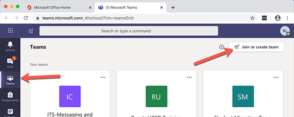

```{r setup, include=FALSE}
options(htmltools.dir.version = FALSE)
library(tidyverse)
library(gt)
library(lubridate)
library(hrbrthemes)
library(xaringanthemer)
library(xaringanExtra)
xaringanExtra::use_tachyons()
library(countdown)
library(googlesheets4)
library(htmltools)
tagList(rmarkdown::html_dependency_font_awesome())
```
```{r themes, warning=FALSE, include=FALSE}
style_duo_accent(primary_color = "#012169", secondary_color = "#005587")

pre_workshop <- read_sheet(params$goog_sheet_pre_workshop)
post_workshop <-
  read_sheet("https://docs.google.com/spreadsheets/d/18-xeU5YAOr0iu7Pk22Zrb0BziLuoVe8nyCyd1-O2R7U/edit#gid=123486400")

mynames_pre <- read_csv("data/colnames_part2_preworkshop.csv")
mynames_post <- read_csv("data/colnames_part2_postworkshop.csv")

colnames(pre_workshop) <- mynames_pre$value
colnames(post_workshop) <- mynames_post$value

pre_workshop <- pre_workshop %>%
  mutate(survey_type = "pre")
post_workshop <- post_workshop %>%
  mutate(survey_type = "post") 

```

layout: true


.footercc[
<i class="fab fa-creative-commons"></i>&nbsp; <i class="fab fa-creative-commons-by"></i> <a href = "https://JohnLittle.info"><span class = "opacity30">https://</span>JohnLittle<span class = "opacity30">.info</span></a> 
<span class = "opacity30"> | <a href="https://github.com/libjohn/rfun_flipped">https://github.com/libjohn/rfun_flipped</a> | `r Sys.Date()` </span>
]

---

class: middle
.tc.bg-light-silver.b--navy.f.ba.bw1.br4.shadow-5.ph4.mt1[

### R for computational sciences

.f3.near-white[  
quickStart: Viz, pivot, join, models
]  

**Flipped Workshop**  
.f6[
`r params$workshop_date`, `r params$workshop_time`
]
]  

Please **complete** the pre-workshop **survey**  (check your email)

.f6.black-40[
https://<a href = "https://johnlittle.info">JohnLittle</a>.info  
https://<a href = "https://Rfun.library.duke.edu">Rfun.library.duke</a>.edu  
Data Science Librarian  
Center for Data & Visualization Sciences  
Duke University Libraries  
library.duke.edu/<a href="https://library.duke.edu/data">data</a>]  

```{r echo=FALSE}
countdown::countdown(minutes = params$countdown_minutes, seconds = 00)
```

---
## Duke University: Land Acknowledgement

I would like to take a moment to honor the land in Durham, NC.  Duke University sits on the ancestral lands of the Shakori, Eno and Catawba people. This institution of higher education is built on land stolen from those peoples.  These tribes were here before the colonizers arrived.  Additionally this land has borne witness to over 400 years of the enslavement, torture, and systematic mistreatment of African people and their descendants.  Recognizing this history is an honest attempt to breakout beyond persistent patterns of colonization and to rewrite the erasure of Indigenous and Black peoples.  There is value in acknowledging the history of our occupied spaces and places.  I hope we can glimpse an understanding of these histories by recognizing the origins of collective journeys.

---
background-image: url(images/who_we_are_2022-09-22_10600.svg)
background-size: contain
<!-- generated from analysis_workshop_attendance/libcal_roster.Rmd -->
<!-- https://github.com/libjohn/workshop_attendance/blob/master/libcal_roster.Rmd -->

---
exclude: false
background-image: url(images/who_we_are_facetwrap_2022-09-22_10600.svg)
background-size: contain
<!-- generated from analysis_workshop_attendance/libcal_roster.Rmd -->
<!-- https://github.com/libjohn/workshop_attendance/blob/master/libcal_roster.Rmd -->

---
```{r response rate plot, echo=FALSE, fig.height=9, fig.width=16, message=FALSE, warning=FALSE, dev="svg"}
response_total <- nrow(pre_workshop)
response_rate <- scales::percent(nrow(pre_workshop) / params$registered)
response_subtitle <- glue::glue('n = {response_total} ; {response_rate} response rate')

my_labels_df <- pre_workshop %>% 
  mutate(day = lubridate::yday(timestamp)) %>% 
  mutate(day_label = lubridate::wday(timestamp, label = TRUE)) |>
  select(day_label, day) |> 
  distinct()


pre_workshop %>% 
  mutate(day = lubridate::yday(timestamp)) %>%
  count(day) %>% 
  ggplot(aes(day, n)) +
  geom_line() +
  geom_point() +
  scale_y_continuous(minor_breaks = NULL, limits = c(0,4)) +
  # scale_y_continuous(breaks = scales::pretty_breaks()) +
  # scale_x_continuous(minor_breaks = NULL, 
  #                    breaks = params$days_of_year_number_range,
  #                    labels = params$days_label) +
  scale_x_continuous(minor_breaks = NULL, 
                     breaks = my_labels_df$day,
                     labels = my_labels_df$day_label) +
  labs(title = "Response rate over time",
       subtitle = response_subtitle, y = "",
       caption = "Source:  CDVS Pre-workshop survey")


```

---
```{r experience plot, echo=FALSE, fig.height=9, fig.width=16, message=FALSE, warning=FALSE, dev="svg"}
pre_workshop %>% 
  pivot_longer(starts_with("tools_"), names_to = "question", values_to = "answer") %>% 
  mutate(question = str_extract(question, ("(?<=tools_)\\w+"))) %>% 
  mutate(question = factor(question, levels = c("coder", "viz", 
                                                "version_ctrl", "cli", "rdbms"))) %>% 
  mutate(answer = factor(answer, levels = c("Daily", "Weekly", "Monthly",
                                            "Several Times per year",
                                            "Less than once per year",
                                            "Never"))) %>% 
  ggplot(aes(fct_rev(question))) +
  geom_bar(aes(fill = answer), position = "fill") +
  coord_flip() +
  scale_fill_brewer(palette = "Dark2") +
  scale_y_continuous(labels = scales::percent) +
  labs(title = "Self-reported tool usage",
       subtitle = "Respondent's use of a tool / technology / technique",
       x = "", y = "Percent", fill = "",
       caption = "Source:  CDVS Pre-workshop survey") +
  theme_ipsum(grid = "X") +
  theme(plot.title.position = "plot") 
```

---

```{r, skills level plot, echo=FALSE, fig.height=9, fig.width=16, message=FALSE, warning=FALSE, dev="svg"}
pre_workshop %>% 
  pivot_longer(ends_with("_experience"), names_to = "question", values_to = "answer") %>% 
  mutate(answer = factor(answer, 
                         levels = c("Strongly agree", "Agree", 
                                    "Neutral", "Disagree", 
                                    "Strongly disagree"))) %>%
  mutate(question = str_extract(question, "\\w+(?=_experience)")) %>% 
  mutate(question  = factor(question,
                            levels = c("import", "scripts",
                                       "baser_viz", "ggplot2",
                                       "interactive", "pivot",
                                       "join"),
                            labels =  c("Import", "Scritps", "Base-R Viz", 
                                        "ggplot2", "Interactive", "Pivot", "Join")
                            )) %>%
  ggplot(aes(fct_rev(question))) +
  geom_bar(aes(fill = answer), position = "fill") +
  coord_flip() +
  scale_fill_brewer(palette = "Spectral") +
  scale_y_continuous(labels = scales::percent) +
  labs(title = "Self-reported R skills",
       subtitle = "Respondents feel capable of completing a Tidyverse task",
       x = "", y = "Percent",
       caption = "Source:  CDVS Pre-workshop survey",
       fill = "") +
  theme_ipsum(grid = "X") +
  theme(plot.title.position = "plot")
```

---

```{r data mgt plot, echo=FALSE, fig.height=9, fig.width=16, message=FALSE, warning=FALSE, dev="svg"}
orange_bar <- fct_count(pre_workshop$viz_workflow_satify, sort = TRUE) %>% 
  mutate(max = max(n)) %>% 
  filter(n == max) %>% 
  # slice_head(n = 1) %>% 
  pull(f)


data_mgt_plot <- pre_workshop %>% 
  ggplot(aes(fct_relevel(viz_workflow_satify, "Very Unsatisfied", "Unsatisfied", 
                         "Neutral", "Satisfied", "Very Satisfied"))) +
  geom_bar() +
  geom_bar(data = . %>% filter(viz_workflow_satify %in% orange_bar), 
           aes(viz_workflow_satify), fill = "darkorange", color = "darkorange") + 
  scale_y_continuous(breaks = seq(0, 3, 3), minor_breaks = NULL) +
  theme_minimal() +
  labs(title = "Satisfaction with current visualization tool workflow",
       subtitle = "self reported",
       x = "", y = "",
       caption = "Source:  CDVS Pre-workshop survey")

data_mgt_plot +
  theme_minimal() +
  theme(plot.title.position = "plot",
        panel.grid.major.x = element_blank())
```

---
background-color:  	#2A2A2A
background-size: contain


```{r dta mgt theme_alt, fig.cap="foo", fig.height=9, fig.width=16, message=FALSE, warning=FALSE, dev="svg", echo=FALSE}
data_mgt_plot +
  theme_ft_rc(grid = "Y") +
  theme(plot.title.position = "plot",
        panel.grid.major.x = element_blank())

# ggsave("images/plot_theme_alt.svg")
```


---
exclude: true
background-image: url(images/plot_theme_alt.svg)

---
exclude: true
class: center, middle
## Microsoft Teams: Rfun

Rfun on MS Teams is a professional learning community for Duke U.

_Teams like Slack_

Join with code **ko8ovx2**



Or, https://is.gd/rfun_teams


---
### Consulting and Questions

Title | URL
--- | ---
Schedule me for consultations | https://is.gd/littleconsult
Consulting & [AskData@Duke.edu](mailto:AskData@Duke.edu)         | https://library.duke.edu/data/consulting

### Resources

Title | URL
--- | ---
rfun_flipped codebase       | https://github.com/libjohn/rfun_flipped
exercises                   | https://github.com/libjohn/intro2r_exercises
Rfun                        | https://rfun.library.duke.edu
Center for data & Viz       | https://library.duke.edu/data


---
class: middle, center

## Reprex

_The most efficient way to get help_

REPROducible EXample and Code

https://reprex.tidyverse.org

--

.tc.bg-light-silver.b--navy.f.ba.bw1.br4.shadow-5.ph4.mt1[
Use the smallest, simplest, most built-in data possible

Include commands on a strict “need to run” basis
]

---

## Format of ggplot2 code

```r

ggplot(data = my_df,
       mapping = aes(x = my_df$var_x, y = my_df$var_y, color = my_df$var_z)) +
  geom_col() +
  geom_line() +
  scale_color_brewer(palette = "<palette_name>") +
  labs(title = "foo", subtitle = "sub_foo",
       x = "new_X", y = "new_Y",
       caption = "source of data")

```

---

## Format of ggplot2 code

```r

my_df |> 
  ggplot(aes(var_x, var_y)) +
  geom_col(aes(color = var_z)) +
  geom_line(color = "navy", size = 2, alpha = 0.5) +
  scale_color_brewer(palette = "<palette_name>") +
  labs(title = "foo", subtitle = "sub_foo",
       x = "new_X", y = "new_Y",
       caption = "source of data")

```


---
exclude: true
background-size: contain
```{r big picture, fig.height=9, fig.width=16, message=FALSE, warning=FALSE, echo=FALSE, dev='svg'}
pre_post_tbl <- bind_rows(pre_workshop, post_workshop)

pre_post_tbl %>% 
  select(timestamp, survey_type, ends_with("_experience")) %>% 
  pivot_longer(ends_with("_experience"),
               names_to = "experience") %>% 
  filter(experience != "import_experience" & experience != "scripts_experience") %>% ################################
  mutate(value = str_to_title(value)) %>% 
  mutate(value = fct_relevel(value, levels = c("Strongly Disagree",
                                       "Disagree",
                                       "Neutral", "Agree", 
                                       "Strongly Agree"))) %>% 
  mutate(experience = str_extract(experience, "\\w+(?=_)")) %>% 
  # mutate(experience = fct_relevel(experience, levels = c(
  #   "import", "subset", "scripts", "projects", "reproducible")
  # )) %>% 
  ggplot(aes(value)) +
    geom_bar(aes(fill = value), color = "black") +
    facet_grid(experience ~ fct_rev(str_to_title(survey_type)))+ 
    scale_fill_brewer(palette = "BrBG") + 
    scale_y_continuous(breaks = c(0,2,4,6)) +
    scale_x_discrete(labels = scales::label_wrap(10)) +
    hrbrthemes::theme_ipsum(grid = "Y", ticks = TRUE) +
    theme(legend.position="none", plot.title.position = "plot") +
  labs(title = "Comparison of Pre & Post survey results",
       x = "", y = "",
       caption = "Source: Registrant surveys at time of workshop")

# ggsave("images/bigpicture.svg", width = 15, height = 10, units = "in")
```

---
layout: false
class:  middle, center

<br>

.bg-washed-blue.b--navy.ba.bw2.br3.shadow-5.ph4.mt5[


## John R Little

.seagull[
.f5[Data Science Librarian  
Center for Data & Visualization Sciences  
Duke University Libraries  
]
]

.f7[https://johnlittle.info  
https://Rfun.library.duke.edu  
https://library.duke.edu/data  
]
]


<i class="fab fa-creative-commons fa-2x"></i> &nbsp; <i class="fab fa-creative-commons-by fa-2x"></i><br> 
.f6.moon-gray[Creative Commons:  Attribution 4.0]  
.f7.moon-gray[https://creativecommons.org/licenses/by-nc/4.0]


